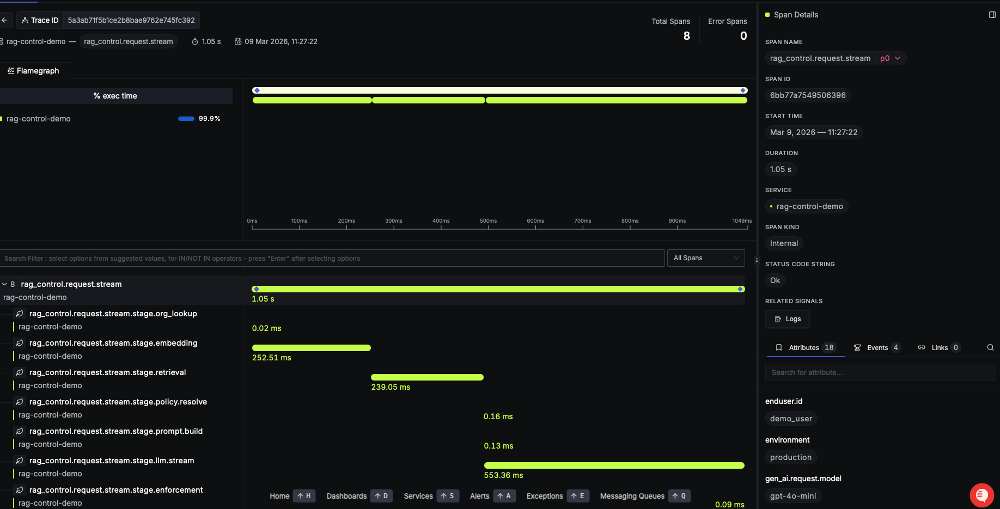

# Distributed Tracing

rag_control integrates with OpenTelemetry for distributed tracing, providing visibility into request execution flow and performance bottlenecks.

## Overview

Distributed tracing tracks:

- Complete request lifecycle
- Stage-by-stage execution
- Latency at each stage
- External service calls
- Errors and exceptions



## Span Hierarchy

Requests create a nested span hierarchy. The root span is `rag_control.request.<mode>` where mode is either `run` or `stream`. Child spans follow the pattern `rag_control.request.<mode>.stage.<stage_name>`:

```
rag_control.request.run (or .stream)
├── rag_control.request.run.stage.org_lookup
├── rag_control.request.run.stage.embedding
├── rag_control.request.run.stage.retrieval
├── rag_control.request.run.stage.policy.resolve
├── rag_control.request.run.stage.prompt.build
├── rag_control.request.run.stage.llm.generate (or .llm.stream)
└── rag_control.request.run.stage.enforcement
```

## Span Attributes

Each span includes relevant attributes:

### Root Request Span

```
rag_control.request.run (or .stream)
├── request_id: "550e8400-e29b-41d4-a716-446655440000"
├── mode: "run" | "stream"
├── org_id: "acme_corp"
├── user_id: "user-123"
└── status: "ok" | "error"
```

### Organization Lookup Span

```
rag_control.request.run.stage.org_lookup
├── filter_name: "enterprise_filter" (or null)
├── retrieval_top_k: 5
└── stage_latency_ms: 2
```

### Query Embedding Span

```
rag_control.request.run.stage.embedding
├── embedding_model: "text-embedding-ada-002"
├── embedding_dimensions: 1536
└── stage_latency_ms: 350
```

### Document Retrieval Span

```
rag_control.request.run.stage.retrieval
├── vector_index: "qdrant" (or other vector store)
├── returned: 5
└── stage_latency_ms: 75
```

### Policy Resolution Span

```
rag_control.request.run.stage.policy.resolve
├── policy_name: "strict_citations"
└── stage_latency_ms: 2
```

### LLM Generation Span

For `run` mode:
```
rag_control.request.run.stage.llm.generate
├── llm_model: "gpt-4"
├── temperature: 0.0
├── max_output_tokens: 512
├── prompt_tokens: 150
├── completion_tokens: 95
├── total_tokens: 245
└── stage_latency_ms: 2000
```

For `stream` mode:
```
rag_control.request.stream.stage.llm.stream
├── llm_model: "gpt-4"
├── temperature: 0.0
├── max_output_tokens: 512
├── prompt_tokens: 150
├── completion_tokens: 95
├── total_tokens: 245
└── stage_latency_ms: 2000
```

### Enforcement Span

```
rag_control.request.run.stage.enforcement
├── policy_name: "strict_citations"
└── stage_latency_ms: 40
```

## Tracing Setup

### Initialize with OpenTelemetry

```python
from opentelemetry import trace
from opentelemetry.sdk.trace import TracerProvider
from opentelemetry.exporter.jaeger.thrift import JaegerExporter
from rag_control import RAGControl
from rag_control.observability import OpenTelemetryTracer

# Setup OpenTelemetry exporter
jaeger_exporter = JaegerExporter(
    agent_host_name="localhost",
    agent_port=6831,
)

trace_provider = TracerProvider()
trace_provider.add_span_processor(
    BatchSpanProcessor(jaeger_exporter)
)
trace.set_tracer_provider(trace_provider)

# Initialize rag_control with tracing
tracer = OpenTelemetryTracer()

engine = RAGControl(
    llm=llm_adapter,
    query_embedding=embedding_adapter,
    vector_store=vector_store_adapter,
    config_path="policy_config.yaml",
    tracer=tracer
)
```

### Tracer Implementations

rag_control supports three tracing implementations:

#### NoOpTracer (If no tracing is needed)

```python
from rag_control.observability.tracing import NoOpTracer

tracer = NoOpTracer()
engine = RAGControl(
    llm=llm_adapter,
    query_embedding=embedding_adapter,
    vector_store=vector_store_adapter,
    config_path="policy_config.yaml",
    tracer=tracer
)
```

#### StructlogTracer (JSON structured logging)

```python
from rag_control.observability.tracing import StructlogTracer

tracer = StructlogTracer()
engine = RAGControl(
    llm=llm_adapter,
    query_embedding=embedding_adapter,
    vector_store=vector_store_adapter,
    config_path="policy_config.yaml",
    tracer=tracer
)
```

#### OpenTelemetryTracer (Recommended for production)

```python
from rag_control.observability.tracing import OpenTelemetryTracer

tracer = OpenTelemetryTracer()
engine = RAGControl(
    llm=llm_adapter,
    query_embedding=embedding_adapter,
    vector_store=vector_store_adapter,
    config_path="policy_config.yaml",
    tracer=tracer
)
```

### Default Tracer Selection

If you don't specify a `tracer` when creating `RAGControl`, it automatically selects based on what's configured:

1. **Checks if OpenTelemetry tracing is configured** via `otel_trace.get_tracer_provider()`
2. **Uses `OpenTelemetryTracer`** if OpenTelemetry SDK is detected
3. **Falls back to `StructlogTracer`** if OpenTelemetry is not configured

This ensures tracing always works: if you've set up OpenTelemetry in your application, rag_control will use it. Otherwise, traces are recorded as structured JSON logs.

```python
from rag_control.core.engine import RAGControl

# Auto-selects tracer based on environment
engine = RAGControl(
    llm=llm_adapter,
    query_embedding=embedding_adapter,
    vector_store=vector_store_adapter,
    config_path="policy_config.yaml",
    # tracer omitted - uses default behavior
)
```

**Fallback behavior:**
- If OpenTelemetry is configured globally → `OpenTelemetryTracer`
- If OpenTelemetry is not configured → `StructlogTracer` (JSON logs)

## Trace Correlation

Traces are automatically correlated with:

- **Request ID**: Unique per request
- **User ID**: From user context
- **Organization ID**: From user context
- **Span Context**: OpenTelemetry context propagation

## Error Handling in Traces

Tracing is designed to never fail or affect request processing. All tracer operations are exception-safe:

- If a span fails to start, a NoOp span is returned that silently accepts all operations
- If span attributes cannot be set, the tracer continues without error
- If context propagation fails, execution continues normally

This design ensures observability never impacts request latency or reliability.

## See Also

- [Audit Logging](/observability/audit-logging)
- [Metrics](/observability/metrics)
- [OpenTelemetry Documentation](https://opentelemetry.io/)
